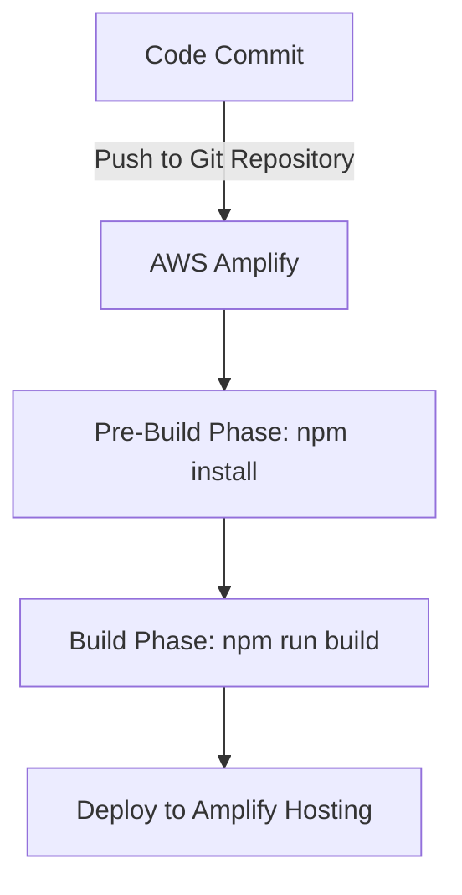

# React To-Do App with AWS Amplify

This project demonstrates how to deploy a React-based To-Do application using AWS Amplify. The setup involves AWS services like Amplify Hosting, authentication, and CI/CD to ensure a seamless deployment experience.

---

## Project Overview

The goal of this project is to:
- Learn AWS Amplify services.
- Build and deploy a React-based To-Do application.
- Set up a CI/CD pipeline for automated deployments.

AWS Amplify simplifies app development by integrating backend services with a frontend framework. The services utilized include hosting, authentication, and build automation.

---

## Repository Details

This repository contains:
1. **Source Code**: React app for managing to-do tasks.
2. **AWS Amplify Configuration**: Integration and hosting details.
3. **YAML File**: Build and deployment instructions.

---

## YAML Configuration

```yaml
defaults:
  version: 1
frontend:
  phases:
    preBuild:
      commands:
        - echo "Installing dependencies..."
        - npm install --cache .npm --prefer-offline || exit 1  # Ensure installation fails if there’s an error
    build:
      commands:
        - echo "Building the application..."
        - npm run build || exit 1  # Ensure the build fails properly if there's an error
  artifacts:
    baseDirectory: dist  # Vite outputs to 'dist' by default; ensure this matches your Vite config
    files:
      - '**/*'  # Include all files in the output directory
  cache:
    paths:
      - .npm/**/*
      - node_modules/**/*
```

---

## Deployment Workflow Diagram

### Workflow Diagram:
1. **Code Commit**: Developers push code to the Git repository.
2. **AWS Amplify**: Detects changes and initiates a build.
3. **Pre-Build Phase**: Installs dependencies.
4. **Build Phase**: Builds the React app.
5. **Deployment**: Deploys the build output to Amplify Hosting.



### Request Flow:
1. **User**: Interacts with the React app hosted on AWS Amplify.
2. **App**: Sends requests to backend services configured with Amplify.
3. **Amplify**: Handles requests and integrates with other AWS services (e.g., API Gateway, DynamoDB).

---

## Features

1. **Task Management**: Create, update, and delete tasks.
2. **Responsive Design**: Optimized for mobile and desktop users.
3. **Continuous Deployment**: Automated build and deploy pipeline using Amplify.

---

## Getting Started

### Clone the Repository
```bash
git clone https://github.com/Suhaill-Saifi/React-ToDo-AWS-Amplify.git
cd React-ToDo-AWS-Amplify
```

### Install Dependencies
```bash
npm install
```

### Run Locally
```bash
npm start
```

---

## Deployment with AWS Amplify

### Step 1: Initialize Amplify
```bash
amplify init
```

### Step 2: Add Hosting
```bash
amplify add hosting
```

### Step 3: Deploy
```bash
amplify publish
```

---

## Technology Stack

- **Frontend**: React.js
- **Deployment**: AWS Amplify
- **CI/CD**: Integrated via Amplify YAML

---

## Screenshots

### AWS Amplify Dashboard

### To-Do Application Interface
  

---

## Author
- **Suhail Saifi**


---

## License

This project is licensed under the MIT License.

---

## Contact

For more information or queries, reach out to:
- **Email**: saifism0786@gmail.com

